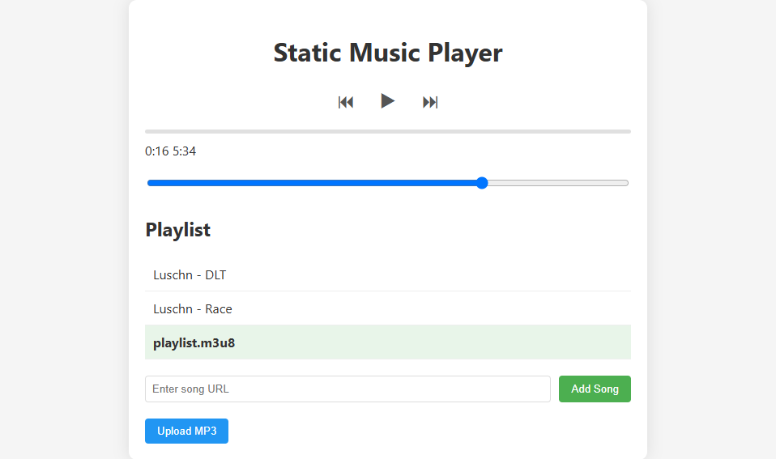

# Static Music Player with HLS Support

A static website that functions as a music player supporting both local MP3 files and HLS streams (m3u8 playlists).

## Features

- Play local MP3 files stored in the repository
- Stream audio from HLS (m3u8) playlists
- Upload and play local MP3 files
- Add songs via URL
- Playlist management
- Volume control
- Progress tracking

## Demo



## Installation

1. Clone the repository or download the files
2. Place your MP3 files in the `assets/audio/` directory
3. Open `index.html` in a modern web browser

## Usage

### Basic Controls
- **Play/Pause**: Click the play button (▶/⏸)
- **Previous/Next**: Navigate through your playlist
- **Volume**: Adjust using the volume slider

### Adding Music
1. **Local Files**:
   - Click "Upload MP3" and select files from your device
2. **URLs**:
   - Enter a direct MP3 or m3u8 URL in the input field and click "Add Song"
3. **Default Playlist**:
   - Edit the `loadDefaultPlaylist()` function in `player.js` to include your default tracks

### HLS Streaming
- The player automatically detects m3u8 playlists
- A pulsing orange dot indicates active streaming
- Supported in most modern browsers (Chrome, Firefox, Edge, Safari)

## Project Structure
```
/web_player/
├── index.html          # Main HTML file
├── css/
│   └── styles.css       # Stylesheet
├── js/
│   ├── player.js        # Main player logic
│   ├── playlist.js      # Empty TODO: Playlist management
│   └── utils.js         # Utility functions
├── assets/
│   ├── audio/           # Local audio files
│   └── images/         # Image assets
└── README.md           # This file
```
## Browser Support

| Browser       | MP3 Support | HLS Support |
|--------------|------------|------------|
| Chrome       | ✅ Yes      | ✅ Yes (via HLS.js) |
| Firefox      | ✅ Yes      | ✅ Yes (via HLS.js) |
| Safari       | ✅ Yes      | ✅ Yes (native) |
| Edge         | ✅ Yes      | ✅ Yes (via HLS.js) |
| IE 11        | ✅ Yes      | ❌ No |

## Development

### Requirements
- Modern web browser
- Text editor (VS Code, Sublime Text, etc.)

### Customization
1. **Styling**: Edit `css/styles.css` to change the appearance
2. **Functionality**: Modify files in the `js/` directory
3. **Default Content**: Update the `assets/audio/` directory and `loadDefaultPlaylist()` function

## Known Limitations

1. As a static site, there's no persistence between sessions
2. Large playlists may impact performance
3. HLS support requires modern browsers
4. No advanced features like equalizers or visualizations

## License

This project is open source and available under the [MIT License](LICENSE).

## Credits

- [HLS.js](https://github.com/video-dev/hls.js/) for HLS streaming support

## Technical Notes

### HLS Implementation Details
The player uses HLS.js to provide HLS streaming support in browsers that don't have native HLS capabilities. For Safari, which has native HLS support, the player falls back to using the browser's built-in functionality.

### Security Considerations
- All file processing happens client-side
- No data is sent to external servers
- URLs are only used for audio playback

### Performance
- The player is optimized for smooth playback
- HLS streams may require more bandwidth than regular MP3s
- Adaptive bitrate streaming depends on server configuration

## Future Enhancements

1. Add playlist persistence using localStorage
2. Add functionality for album artwork extraction
3. Support for more audio formats
4. Mobile app wrapper for better mobile experience
